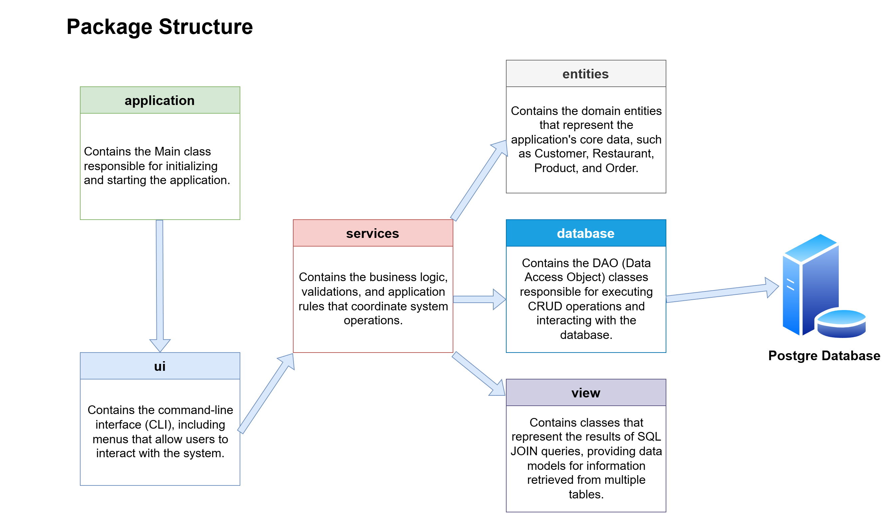
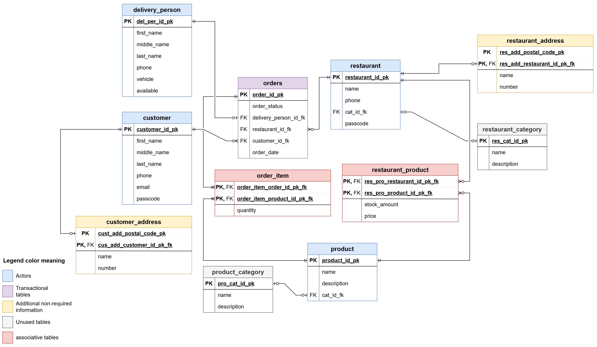
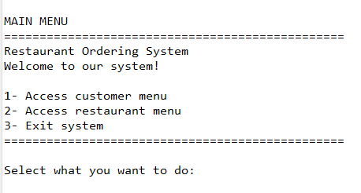
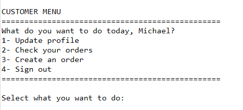
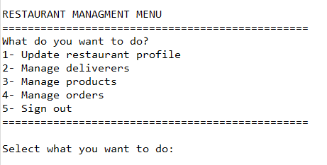

# Restaurant Delivery Management System

A Java console application integrated with PostgreSQL for managing restaurants, customers, delivery personnel, products, and orders.

## 📑 Table of Contents

- [Overview](#-overview)
- [Features](#-features)
- [Project Requirements](#-project-requirements)
- [Technologies](#-technologies)
- [Repository Structure](#-repository-structure)
- [Project Architecture](#-project-architecture)
- [Database](#-database)
- [Documentation](#-documentation)
- [How to Run](#-how-to-run)
- [Usage](#-usage)
- [Future Improvements](#-future-improvements)
- [License](#-license)
- [About Me](#-about-me)

-----------------------

## 🔍 Overview

The **Restaurant Delivery Management System** is a Java console application designed to manage the core operations of a food delivery service. The project integrates **Java** with **PostgreSQL** through **JDBC**, applying object-oriented programming principles alongside relational database design.

The system models a real-world delivery environment with the following main actors:

* **Customers** can register, manage their personal information, and place orders from participating restaurants.
* **Restaurants** can manage their products, monitor incoming orders, and maintain their business information.
* **Delivery Personnel** are responsible for delivering orders and can be assigned to deliveries based on their availability.

The project follows a layered architecture that separates the application into distinct packages for business logic, database access, entities, user interface, and application execution. It also includes comprehensive database documentation, UML diagrams, and SQL scripts for database creation, sample data insertion, and analytical queries.

---

## 💎 Features

### Customer

* Create and manage customer accounts
* Update personal information
* Register delivery addresses
* Browse restaurant products
* Place orders from a single restaurant
* View order history and order status

### Restaurant

* Manage restaurant information
* Add, update, and remove products
* Manage product inventory and pricing
* View and update customer orders
* Add, update, and remove delivery personnel
* Assign available delivery personnel to orders

### Delivery Personnel

* View assigned deliveries
* Update delivery status

---

## 📊 Project Requirements

The objective of this project is to develop a **food delivery management system** using **Java** and **PostgreSQL**, integrating object-oriented programming concepts with a relational database.

### Functional Requirements

* Manage customers, restaurants, products, delivery personnel, and orders.
* Perform full **CRUD** operations for all system entities.
* Associate products with restaurants.
* Allow customers to place orders containing multiple products.
* Assign available delivery personnel to orders.
* Track order status through the delivery process.
* Store and retrieve all application data using PostgreSQL.

### Technical Requirements

* Developed using **Java** following object-oriented programming principles.
* Uses **PostgreSQL** as the relational database.
* Connects to the database through **JDBC**.
* Implements relational modeling with **one-to-many** and **many-to-many** relationships.
* Includes SQL queries using **JOIN**, aggregation functions, and window functions.
* Provides complete project documentation, including architecture, class, and database diagrams.

### Business Rule

When assigning a delivery person to an order, the system verifies whether the delivery person is available. If available, the order is assigned and the delivery person's status is updated accordingly.


---

## 🖥 Technologies

| Category                     | Technologies                    |
| ---------------------------- | ------------------------------- |
| **Programming Language**     | Java                            |
| **Database**                 | PostgreSQL                      |
| **Database Connectivity**    | JDBC                            |
| **Development Tools**        | Eclipse IDE, Visual Studio Code |
| **Database Management**      | pgAdmin                         |
| **Documentation & Diagrams** | Draw.io, Dia                    |
| **Version Control**          | Git, GitHub                     |


---

## 🏗 Repository Structure

The repository follows this structure:

```text
restaurant_ordering_system/
├── database/                                 # Database scripts
│   ├── analysis_queries/                     # SQL queries for reports and data analysis
│   ├── archive/                              # Archived script versions
│   ├── 01_init_database.sql                  # Database creation script
│   ├── 02_create_database_tables.sql         # Table definitions and constraints
│   └── 03_insert_sample_data.sql             # Sample data for testing
│
├── docs/                                     # Project documentation
│   ├── application/
│   │   ├── class_diagram/                    # UML class diagrams
│   │   ├── images/                           # Usage images
│   │   ├── old_system_overview_prototype/    # Legacy project references
│   │   ├── package_architecture/             # Application architecture diagrams
│   │   └── naming_conventions.md             # Java naming conventions
│   │
│   └── database/
│       ├── entity_relationship_diagram/      # Database ER diagrams
│       ├── data_dictionary.md                # Database data dictionary
│       └── naming_conventions.md             # Database naming conventions
│
├── java/
│   └── DeliveryManagementSystem/
│       ├── lib/                              # External libraries
│       └── src/
│           ├── application/
│           ├── database/
│           ├── entities/
│           ├── services/
│           ├── ui/
│           └── view/
│
├── .gitignore                                # Git ignore rules
├── LICENSE                                   # Project license
└── README.md                                 # Project overview and setup guide
```

---

## 🛠 Project Architecture

The application follows a layered architecture that separates responsibilities into distinct packages, improving code organization, maintainability, and scalability.

Each layer is responsible for a specific part of the system, including application startup, database access, business logic, domain entities, and user interaction.

This separation of concerns promotes a modular design and simplifies future development and maintenance.



---

## 📂 Database

The system uses **PostgreSQL** as its relational database management system. The database was designed to represent the core entities of a food delivery platform, including customers, restaurants, products, delivery personnel, and orders.

The database follows a normalized relational model with **one-to-many** and **many-to-many** relationships to ensure data consistency and avoid redundancy. It includes tables for managing business data, customer information, product availability, order details, and delivery assignments.

The project also includes SQL scripts for database creation, table definitions, sample data insertion, and analytical queries using joins, aggregations, and other SQL features.



[Data dictionary link](docs/database/data_dictionary.md)

---

## 📚 Documentation

This repository includes detailed documentation covering the system design, database structure, and development decisions.

Available documentation:

* **Application Architecture**
  Overview of the system layers, package organization, and application structure.
  - [Application Architecture](docs/application/package_architecture/package_architecture.png)

* **UML Class Diagrams**
  Diagrams representing the application's classes, attributes, methods, and relationships.
  - [UI Diagram + Flow](docs/application/class_diagram/ui_diagram/ui_package_diagram.png)
  - [Services Diagram](docs/application/class_diagram/services_diagram/services_diagram.png)
  - [Entities Diagram](docs/application/class_diagram/entities_diagram/entities_package_diagram.png)
  - [Data Access Object Diagram](docs/application/class_diagram/dao_diagram/data_access_object_diagram.png)


* **Entity Relationship Diagram (ERD)**
  Visual representation of the database entities, relationships, and constraints.
  - [Entity Relationship Diagram](docs/database/entity-relationship_diagram/relational-model.png)

* **Data Dictionary**
  Detailed description of database tables, columns, data types, and relationships.
  - [Data Dictionary](docs/database/data_dictionary.md)

---

## 💾 How to Run

### Prerequisites

Before running the application, make sure the following tools are installed:

* **Java JDK 8+** 
* **PostgreSQL**
* **pgAdmin** (optional, for database management)
* **Eclipse IDE** or another Java IDE

### Database Setup

1. Create the PostgreSQL database using the script:

```
database/01_init_database.sql
```

2. Create the required tables:

```
database/02_create_database_tables.sql
```

3. Insert sample data (optional):

```
database/03_insert_sample_data.sql
```

4. Verify that the database is running correctly.

### Application Setup

1. Clone this repository:

```bash
git clone https://github.com/Rodrigo3441/restaurant_ordering_system.git
```

2. Open the Java project located in:

```
java/DeliveryManagementSystem/
```

3. Configure the PostgreSQL connection settings in the `DatabaseConnection` class inside database package.

4. Make sure the PostgreSQL JDBC driver is available in the project libraries.

### Running the Application

1. Open the project in your Java IDE.
2. Build the project.
3. Run the main application class:

```
application.Main
```

The application will start through the console interface and allow interaction with the restaurant delivery system.

---

## Usage

- After starting the application, users can interact with the system through a console-based menu interface.

- The application communicates with PostgreSQL through JDBC to store and retrieve all system data.


### Application Screenshots

#### Main Menu



#### Customer Menu




#### Restaurant Menu



---

## Future Improvements

Possible improvements and future expansions for this project include:

* Implement a complete authentication system with secure password encryption.
* Develop a graphical user interface (GUI) or a web-based version of the application.
* Expand product management by adding product categories and advanced filtering options.
* Improve the order tracking system with more detailed delivery progress updates.
* Enhance exception handling and validation throughout the application.
* Add automated testing to improve reliability and maintainability.

---

## License

This project is licensed under the [MIT License](LICENSE). You are free to use, modify, and share this project with proper attribution.

---
## 👨‍💻 About Me

Hi! i'm Rodrigo, a data engineer student that is learning new things every day.